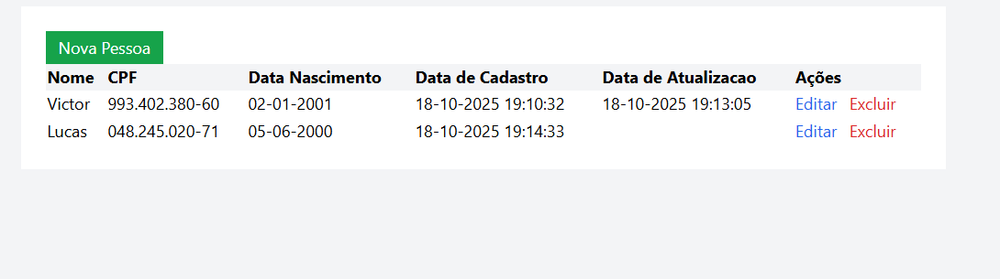

# Cadastro de pessoas

### Stacks:

- **C#**
- **.NET Core**
- **Entity Framework**
- **React**
- **SQLite**

Execute o comando dotnet run na pasta cadastro_de_pessoas.Server ou abra o projeto no Visual Studio Community e pressione F5 para executá-lo.

